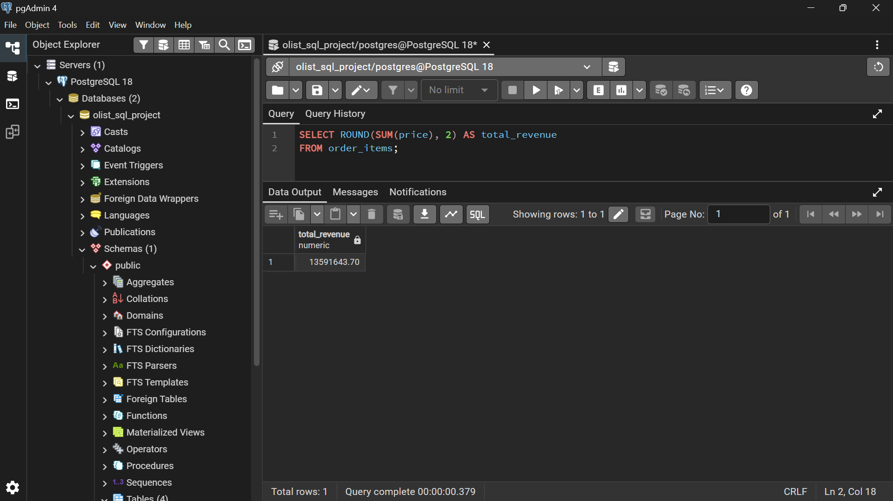
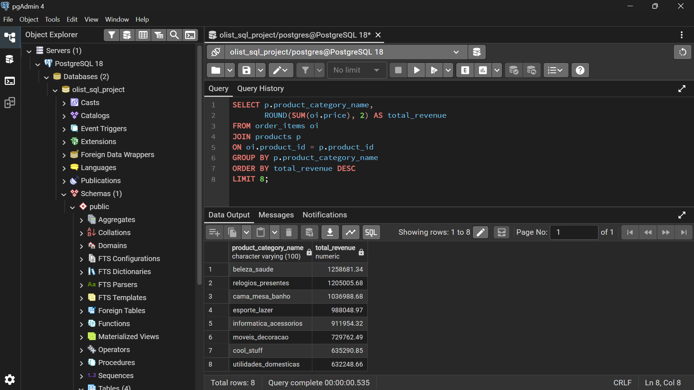
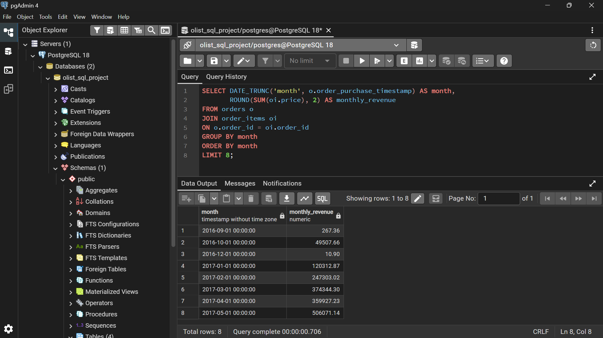
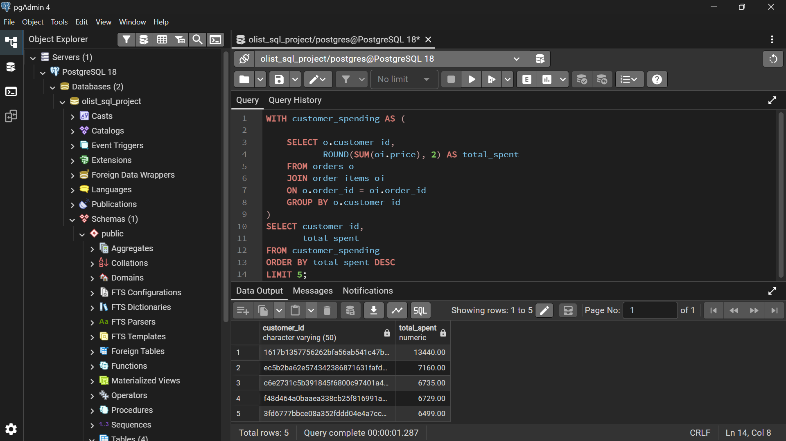
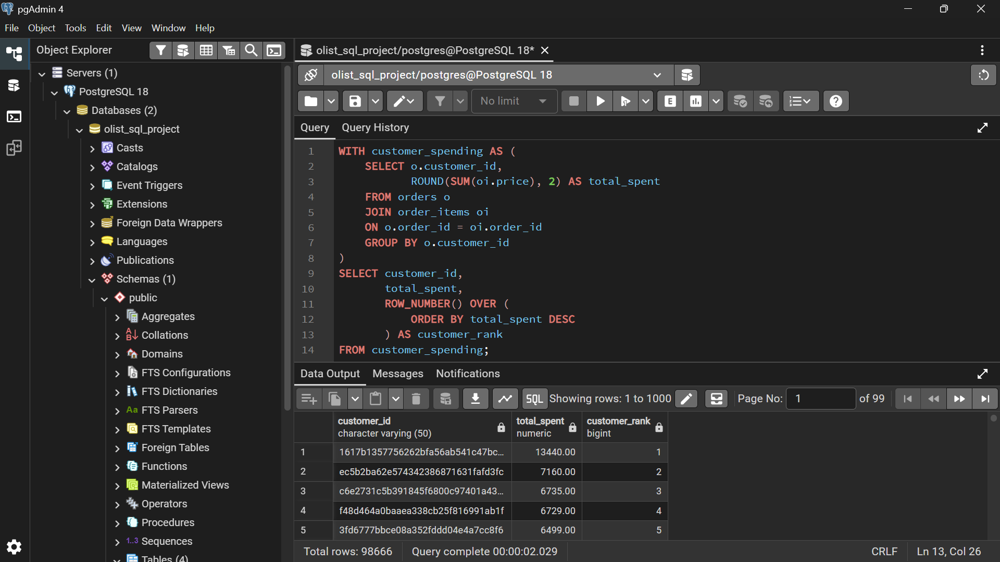

# E-Commerce SQL Analysis Project

## Project Overview

This project analyzes the Brazilian Olist e-commerce dataset using PostgreSQL.

The goal was to explore:
- customer behavior
- product performance
- revenue trends
- operational metrics

using SQL-based analysis.

## Dataset

Source:
Olist Brazilian E-Commerce Dataset (Kaggle)

Main tables used:
- customers
- orders
- order_items
- products

## Tools Used

- PostgreSQL
- pgAdmin
- VS Code


## SQL Concepts Applied

### Basic SQL
- SELECT
- WHERE
- ORDER BY
- GROUP BY
- Aggregate Functions

### Intermediate SQL
- Joins
- Date Functions
- Revenue Analysis
- Trend Analysis

### Advanced SQL
- CTEs
- Window Functions
- ROW_NUMBER()
- RANK()
- PARTITION BY

## Data Cleaning Checks

The project included basic data quality validation using SQL queries.

Checks performed:
- Missing product categories
- Missing customer IDs
- Null value validation

Example queries:

```sql
-- Missing Product Categories
SELECT COUNT(*)
FROM products
WHERE product_category_name IS NULL;

-- Missing Customer IDs
SELECT COUNT(*)
FROM customers
WHERE customer_id IS NULL;
```

## Project Structure

```text
ecommerce-sql-analysis/
│
├── dataset/
├── schema/
├── queries/
├── insights/
├── screenshots/
└── README.md
```

## Key Business Insights

- Revenue was concentrated in a small number of product categories.
- Monthly sales trends revealed changing purchasing patterns.
- Top customers contributed disproportionately high spending.
- Product category performance varied significantly.

## Learning Outcomes

This project strengthened practical skills in:

- Relational database design
- SQL query writing and optimization
- Table joins and aggregation analysis
- Revenue and trend analysis
- Data cleaning and validation
- Common Table Expressions (CTEs)
- Window functions and ranking analysis
- Business insight generation
- Structured project organization
- Real-world dataset handling using PostgreSQL

## Query Output Screenshots

### Total Revenue Analysis



### Top Revenue Generating Categories



### Monthly Revenue Trend



### Top Customer Spending Analysis



### Customer Ranking Using Window Functions




# Author

**Saami Anware** 